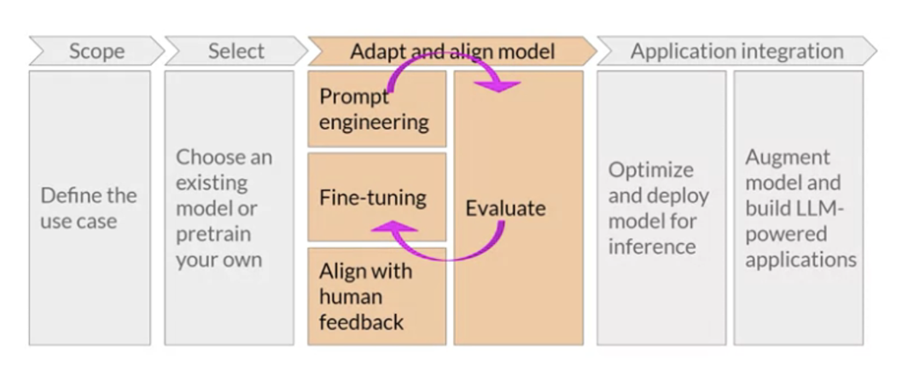

# Summarising dialogue using FLAN-T5

This is a simple project that was undertaken to perform the task of dialogue summary using Generative AI. Through the
use of different techniques to inference process, the exploration of how different prompts can affect the completion of
the model were performed. Prompt engineering was carried out, by comparing zero shot, one shot and few shot inferences,
with the intention to see how to best enhance the generative output of the LLM. This is part of `Adapt & Align model`,
which is only one  of ghe steps involved during the generative AI project lifecycle. Additional changes were also made
to the configuration parameters, to best understand the influence they make, in terms of the model's ability to make a
final decision about next word generation. Configuration parameters that were changed: `do_sample`, `temperature`, `top_k`
& `top_p`

## Generative AI project lifecycle

## Model and dataset

Model: [FLAN-T5](https://huggingface.co/docs/transformers/model_doc/flan-t5)  
Dataset: [DialogueSum](https://huggingface.co/datasets/knkarthick/dialogsum)

## Prerequisites

- Python3
- Jupyter
- Hugging Face
- PyTorch

## License

Distributed under the MIT License. See `LICENSE` for more information.
